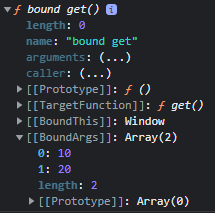

# this

## this 와 글로벌 오브젝트

- 글로벌 오브젝트에서 this는 글로벌 오브젝트 참조
- window 와 글로벌 오브젝트를 같게 사용한다

#### window 메소드 외부에서 사용하는 경우

- this가 window를 참조하는 경우
- this로 글로벌 변수를 참조하는 경우
- window로 글로벌 변수를 사용하는 경우
- this.value = 100 처럼 형태로 값을 할당하는 경우

#### window 메소드 내부에서 사용하는 경우

- this 가 window 참조하는 경우
- this로 로컬 변수를 사용하는 경우
- this.value = 100 처럼 형태로 값을 할당하는 경우

## this 참조

### this 와 strict 모드

- strict 모드에서는 `window.book()` 처럼 book 앞에 window 를 글로벌 오브젝트로 작성해야 한다
- 함수 앞에 오브젝트를 작성하지 않으면 this 바인딩 컴포넌트에 undefined가 설정되므로 this 로 window 를 참조할 수 없다.

### this 참조 오브젝트

- this가 참조하는 오브젝트

```js
const book = {
    point: 100,
    member : {
        point: 200,
        get: function(){
            console.log(this === book.member)
            console.log(this.point)
        }
    }
}
book.member.get()
// true
// 200
```

## this와 인스턴스

### 인스턴스에서 this의 목적

- this 로 인스턴스를 참조하여 this.name 형태로 프로퍼티에 접근한다

- `__proto__` 프로퍼티 접근

  prototype에 연결된 프로퍼티가 인스턴스의 `__proto__`에 첨부되어 this.method() 형태로 `__proto__`에 첨부된 method() 호출

## this와 call()

- getTotal.call(this, 10, 20) 처럼 인자를 전달한다

```js
'use strict'
var value = 100
function get(param){
    return param + this.value
}
var result = get.call(this, 20)
console.log(result)
// 120
```

- get(20) 으로 호출하면 this 가 undefined 를 참조하므로 에러가 발생한다 

```js
var book = {
    value: 123,
    point : {
        value: 456,
        get: function(){
            console.log(this.value)
        }
    }
}

book.point.get.call(book)
book.point.get.call(book.point)
// 123
// 456
```

## this와 apply

- apply 사용법은 call 가 같으며 파라미터가 배열이다
- getTotal.apply(this, [10, 20])
- 두 번째 파라미터 수가 유동적일 때 사용하고 반면에 call()은 파라미터 수가 고정일 때 사용한다 

## this와 콜백 함수

- 콜백 함수가 있는 메소드는 두번째 파라미터에 this 로 참조할 오브젝트를 선택적으로 생성한다
- map, forEach

```js
var obj = {value : 100}
var data = [5, 6, 7]

function callback(element, index, data){
    return element + this.value
}

function get(data){
    return data.map(callback, obj)
}

var result = get(data)
console.log(result)
```


## this와 bind() 메소드 

- 두번에 나누어 처리
  1. function 오브젝트 생성
  2. 생성한 function 오브젝트를 함수로 호출

- 파라미터
  - 첫번째 파라미터에 함수에서 this로 참조할 오브젝트
  - 두번째 파라미터에 호출된 함수의 파라미터 값 

```js
var book = {
    point: 456,
    get() {
        return this.point
    }
}

var obj = book.get.bind(book)
console.log(typeof obj)
var result = obj()
console.log(result) // 456
```

#### 파라미터 병합

```js
var book = {
    get(){
        return Array.prototype.slice.call(arguments)
    }
}
var obj = book.get.bind(this, 10, 20)
console.dir(obj)
var result = obj(30, 40)
console.log(result) // [10, 20, 30, 40]
```



